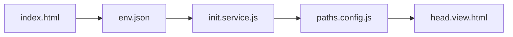

# QE-Demo Enterprise Architecture Documentation

## 1. Foundation Layer

### 1.1 Environment Management
- **env.json**: Core configuration store
  - Manages SITE_STATE (dev/prod)
  - Defines path configurations
  - Stores GENESIS_USER template
  - Controls feature flags

### 1.2 Initialization Chain


### 1.3 Global Namespace
- window.env: Environment configuration
- window.QE: Application namespace
  - User service
  - Path resolution
  - State management

## 2. Service Architecture

### 2.1 Core Services
- **FontManager**: Font preference handling
- **ThemeManager**: Theme state management
- **BaseService**: Service foundation class
  - Debug mode control
  - Cache service integration
  - Environment awareness

### 2.2 View Services
- Path resolution
- Asset management
- Layout composition

## 3. Controller Layer

### 3.1 Base Controller Pattern
```javascript
class BaseController {
    #logger;
    #view;
    #isInitialized = false;
    #componentName;
}
```

Key features:
- Unified error handling
- Authentication checking
- View initialization
- Event management

### 3.2 Controller Hierarchy
- WelcomeController: Entry point
- BaseController: Foundation class
- Specialized controllers: Inherit base patterns

## 4. View Architecture

### 4.1 Layout System
- Modular template composition
- BEM methodology
- Responsive design patterns

### 4.2 Style Organization
```
styles/
├── base/
│   ├── _variables.css
│   ├── _reset.css
│   └── _typography.css
├── layouts/
└── components/
```

## 5. Security Architecture

### 5.1 Authentication
- Genesis admin initialization
- Role-based access control
- Session management

### 5.2 Environment Security
- Development/Production separation
- Path sanitization
- Resource access control

## 6. Data Flow

### 6.1 State Management
- User preferences
- Theme state
- Font preferences
- Authentication state

### 6.2 Service Communication
- Event-driven architecture
- Observer pattern implementation
- Centralized state management

## 7. Error Handling

### 7.1 Error Hierarchy
- Service-level errors
- Controller error management
- View error display

### 7.2 Logging Strategy
- Debug mode conditioning
- Error categorization
- User feedback system

## 8. Asset Management

### 8.1 Path Resolution
```javascript
PathResolver = {
    resolve: (path) => `${baseURL}${path}`,
    getAssetPath: (name) => `${envPaths.ASSET_PATH}/${name}`,
    getModulePath: (name) => `${envPaths.MODULE_PATH}/${name}`
}
```

### 8.2 Resource Loading
- Environment-aware paths
- Lazy loading patterns
- Cache management

## 9. Deployment Architecture

### 9.1 Development
- Local server (port 5500)
- Debug mode enabled
- Expanded logging

### 9.2 Production
- AWS deployment
- Optimized paths
- Security hardening

## 10. Extension Points

### 10.1 Service Extension
- BaseService inheritance
- Controller customization
- View composition

### 10.2 Feature Flags
- Environment-specific toggles
- Conditional functionality
- A/B testing support

## 11. Technical Recommendations

1. Maintain strict initialization order
2. Follow established naming conventions
3. Leverage provided base classes
4. Utilize path resolution system
5. Implement proper error handling
6. Respect environment distinctions
7. Follow BEM methodology
8. Use service patterns consistently
9. Maintain controller hierarchy
10. Document architectural changes

## 12. Future Considerations

1. Enhanced caching strategies
2. Advanced state management
3. Component lazy loading
4. Security hardening
5. Performance optimization
